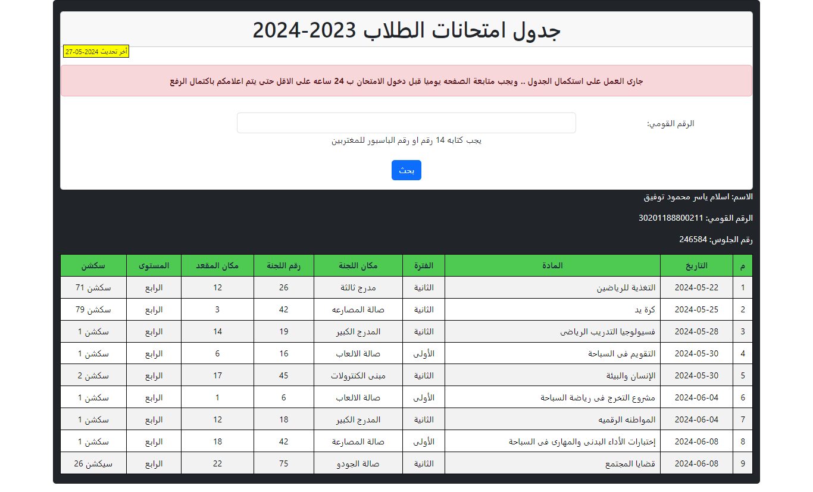

# Students Exam Calender and Places

**Project description:** 
  This project is designed to display the exam schedule in a tabular format, along with the locations of the students' desks.

**How to use it:**
  Students enter their national ID number as a unique identifier, and then the exam schedule and desk location are displayed below the input screen.

**Tools:**
 - PHP Native
 - MySQL

**Images:**
  
